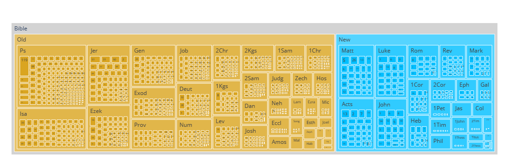
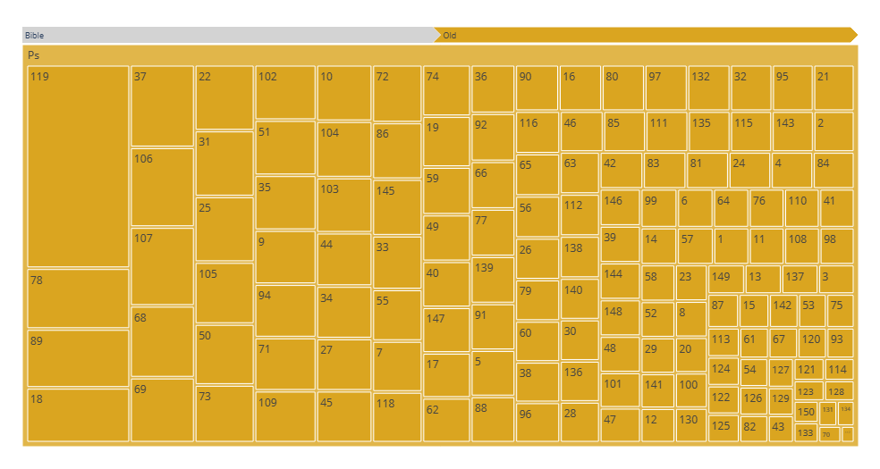
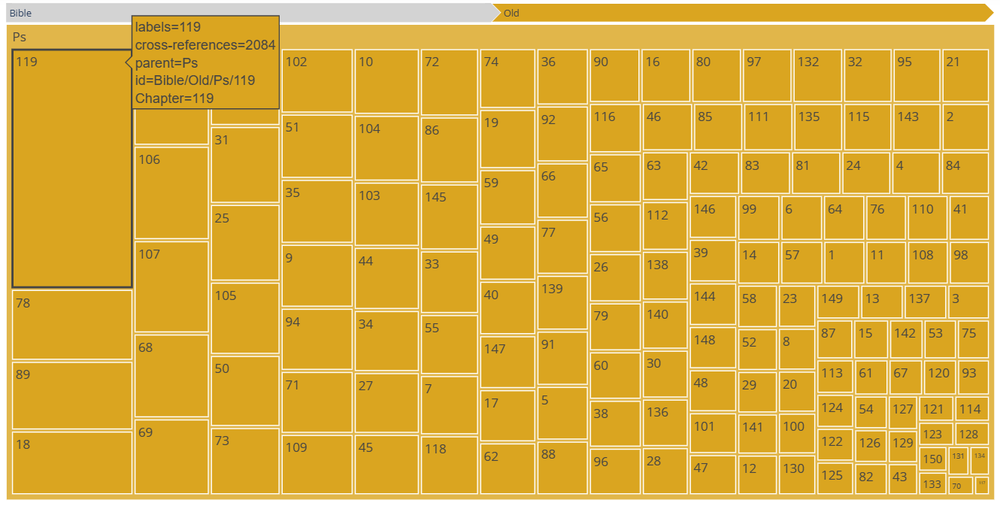

# Bible cross-reference tools 
Data from [openbible.info](https://www.openbible.info/labs/cross-references/), www.openbible.info CC-BY 2024-03-11

`cross_references_expanded.csv` was derived from openbible.info original data table, and parsed and expanded for added flexibility and sortability.

[`openbible_from_verse_libraries_BibleGateway_query.ipynb`](https://github.com/shandran/openbible/blob/main/openbible_from_verse_libraries_BibleGateway_query.ipynb) creates dataframe dictionaries of every chapter in every book of the Bible. Then, for a *from verse* query of interest, you can generate Bible Gateway scripture links (in ESV by default, but this can be changed) to every *to verse* cross-referenced to the query verse.

[`openbible_from_verse_libraries_treemap.ipynb`](https://github.com/shandran/openbible/blob/main/openbible_from_verse_libraries_treemap.ipynb) generates an interactive plotly treemap of all 344,799 *from verse* cross-references.

Clicking on a book (e.g., Psalms) updates the treemap with only the chapters in the selected book.

Hovering over a chapter of interest (e.g., Psalm 119) brings up a tooltip giving hierarchical data about the chapter, including the sum total of cross-references in this chapter to the rest of the Bible. In this case, Psalm 119 has the most cross-references in the entire Bible at 2,084. Acts 13 has the second-most number of cross-references to the rest of the Bible, coming in at 968 (see line 21 of [`openbible_from_verse_libraries_treemap.ipynb`](https://github.com/shandran/openbible/blob/main/openbible_from_verse_libraries_treemap.ipynb)).

